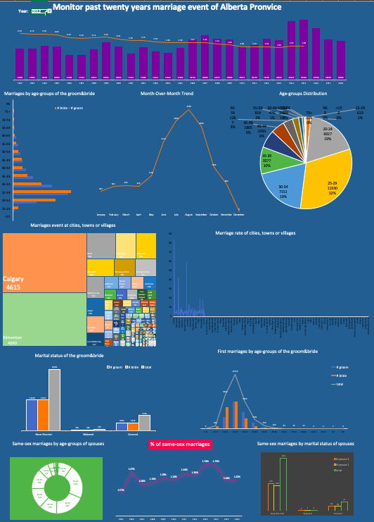

# analysis-of-alberta-marriages-event-for-recent-year
Data sources are from https://open.alberta.ca/

## Changes based on Year&Month
- The purple histgram shows marriages event of year 1992 to 2018 in Alberta province with the crude marriage rate from year 1992 to 2015. The marriage rate is declining yearly.
- From month-over-month trend, July and August seem a good season for people to get married. 
- Every year, May is a month of dramatic increase of marriages and it goes down around September. 
- Although Alberta is said a four-season, winter takes major part of year. The weather starts to get warmer around May, and it reached to the hottest month July. 
- Therefore, people tend to choose warm season to finish their most important event in their life.

## Changes based on age
- At right side, Age-groups pie chart demonstrates 20-29 takes around 50% overall, and 30-34 also takes large portion. It seems like people like to get married at their early age. 
- At left side, 2-D bar shows marriages by age-groups of the groom&bride. It shows female tends to get married earlier than male before 30, but after 30, marriages number of male is larger than
 female. 
- As age is getting older, female have more finical support and more specific life target other than just marry to someone. By contrast, male is getting more mature as age is bigger. 
It may be a time to settle down after success business for male. 

## Changes based on location
- The treemap at left side shows Alberta cities, towns and villages marriages event. From map, it can be easily seen larger cities takes majority of map. However, the marriage rate of these 
Cities,Calgary and Edmonton, is not highest one, instead Banff, Jasper and Cardston, famous tourist towns, takes the highest marriage rate. 
- From year 2001, marriage rate of Calgary, Edmonton is in decline. 

## Changes based on marital status
- Most people are never married as their marital status. 
- The groom and the bride takes almost same ratio of their marital status.

## Changes based on same-sex
- Since 2005, same-sex marriage is legal. The connective year takes dramatic increase over total marriages, but the years after increase slowly instead. 
- First legal year, the larger number of greater than 35 years old people get married. After that, age of younger people get married increased. 
- Most marital status is never-married, and two spouses takes same ratio of marital status. 

